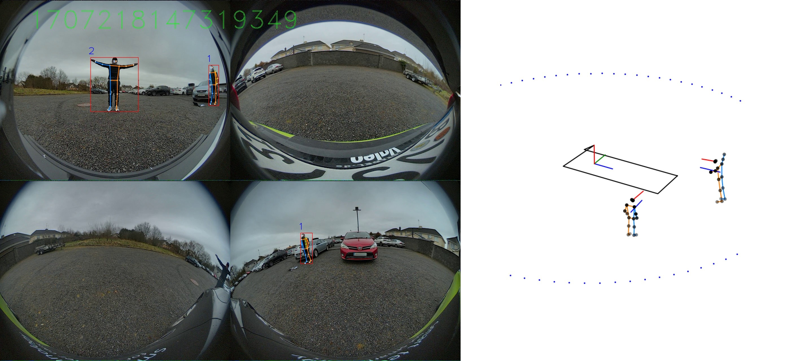

# Latest news:

- **19/11/2025:** Valeo Near-Field (VNF) Dataset and it's first benchmark is presented on ICCVW. Initial version of the public data is online.

# Contact Information:

- In case of questions or further details, please contact Antonyo MUSABINI, antonyo.musabini@valeo.com

# Valeo Near–Field: a novel dataset for pedestrian intent detection.

<p align="center">
  
</p>

## Abstract

This paper presents a novel dataset aimed at detecting pedestrians’ intentions as they approach an ego-vehicle. The dataset comprises synchronized multi-modal data, including fisheye camera feeds, lidar laser scans, ultrasonic sensor readings, and motion capture-based 3D body poses, collected across diverse real-world scenarios. Key contributions include detailed annotations of 3D body joint positions synchronized with fisheye camera images, as well as accurate 3D pedestrian positions extracted from lidar data, facilitating robust benchmarking for perception algorithms. We release a portion of the dataset along with a comprehensive benchmark suite, featuring evaluation metrics for accuracy, efficiency, and scalability on embedded systems. By addressing real-world challenges such as sensor occlusions, dynamic environments, and hardware constraints, this dataset offers a unique resource for developing and evaluating state-of-the-art algorithms in pedestrian detection, 3D pose estimation and 4D trajectory and intention prediction. Additionally, we provide baseline performance metrics using custom neural network architectures and suggest future research directions to encourage the adoption and enhancement of the dataset. This work aims to serve as a foundation for researchers seeking to advance the capabilities of intelligent vehicles in near-field scenarios.

[](https://arxiv.org/abs/24XX.XXXXX)
[](https://creativecommons.org/licenses/by-nc-sa/4.0/)

This work is licensed under a Creative Commons Attribution–NonCommercial–ShareAlike 4.0 International License.


## Citation

If you use the VNF dataset or our paper in your research, please cite us using the following BibTeX entry:

```bibtex
@inproceedings{vnf_dataset_2025,
  title     = {Valeo Near–Field: a novel dataset for pedestrian intent detection},
  author    = {Antonyo Musabini, Jagdish Bhanushali, Rachid Benmokhtar, Xavier Perrotton, Victor Galizzi, Bertrand Luvison},
  booktitle = {Proceedings of the 2025 IEEE/CVF International Conference on Computer Vision Workshops (ICCVW)},
  year      = {2025},
  month     = {October}
}
```

## Dataset Access

The full dataset can be downloaded from the following link:

**[>> Download the VNF Dataset <<](https://drive.google.com/drive/folders/12gmb35DLEQ3Nd5rov_mhHOue0-uTsYrB?usp=sharing)**
